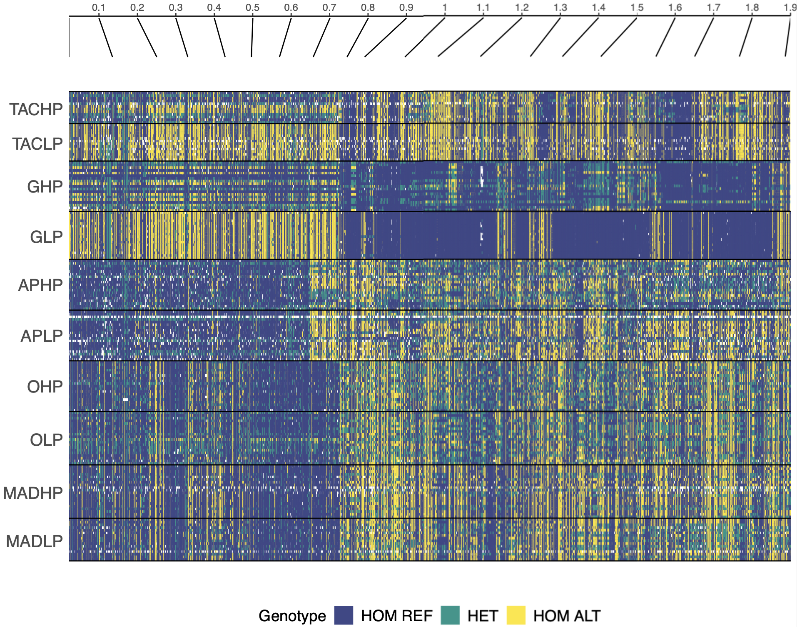
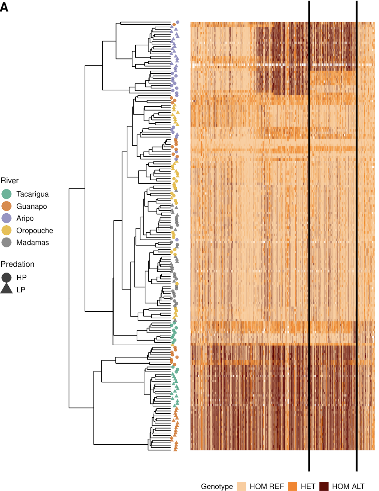

# Genotype Plot
## Visualise and cluster genotypes based on a VCF
This function can be used to subset VCFs for regions and individuals of interest and produce high-quality figures for publications.

Currently, it will only work on a unix-based OS i.e. Mac or Linux as they depend on `bcftools` to subset the VCF before reading in.

To use these scripts, simply clone the repo and source the code into R. For e.g.
```
git clone https://github.com/JimWhiting91/genotype_plot.git
```
In R:
```
source("path/to/genotype_plot/R")
```

## Tutorial
The scripts are really just a single function that handles everything. A typical call requires the following inputs:
```
new_plot <- genotype_plot(vcf="path/to/vcf",
                          chr="chr1",
                          start=1e6,
                          end=2e6,
                          popmap=our_popmap,
                          cluster=FALSE,
                          snp_label_size=1e5,
                          colour_scheme=c("#d4b9da","#e7298a","#980043"))
            
  # Usage:
  # vcf = a bgzipped VCF 
  # chr = chr of scaf ID
  # start = start of region
  # end = end of region
  # popmap = two column data frame with column 1 for individual IDs as they appear in the VCF and column 2 for pop labels
  # cluster = whether to organise haplotypes by hclust clustering
  # snp_label_size = breaks for position labels, eg. plot a position every 100,000 bp.
  # colour_scheme = character vector of colour values
 
```
Genotypes are plotted according to the popmap order, so genotypes are visualised within populations, labelled according to `unique(popmap[,2])`, and are plotted in the order they appear in `popmap[,1]`, unless `cluster=TRUE` (see below).

If `cluster=TRUE`, haplotypes are clustered according to `hclust`. This is not designed to be an explicit test of phylogeny, but can be useful to quickly visualise haplotype relationships. If `cluster=TRUE`, haplotypes are no longer labelled because the ordering is no longer user-defined but defined by the clustering. New labels in clustered order are returned in the output as `dendro_labels` (see Outputs).

The script first uses bcftools to subset the VCF based on the path given and co-ordinates. This is simply so we're not reading a VCF larger than needs be into R.
```
  # Subset our VCF
  system(paste0("bcftools view -r ",chr,":",start,"-",end," ",vcf," > gt_plot_tmp.vcf"),wait=TRUE)
```
This command therefore writes a new file to the working directory called `gt_plot_tmp.vcf` which is read in and then removed from the system with a call to `rm -f`.

After this, all plots are generated.

## Inputs
The function handles the VCF outside of R using calls to `system()`, so the input in terms of the vcf and region of interest are just character strings, as described above.

The popmap should be a `data.frame` object with two columns: first column = individual IDs as they appear in the VCF, and second column = population label. The values from column 2 are used as labels in the final plot. Column names are irrelevant, but the order must be column 1 for inds and column 2 for pop. This can either be made within R or read in from a file with `read.table()`.

An example popmap should look like this:
```
> head(popmap)
     ind pop
1 LT_F16  TACHP
2 LT_F18  TACHP
3 LT_F19  TACHP
4 LT_F23  TACHP
5 LT_F24  TACHP
6  LT_M1  TACHP
```

The VCF is also filtered using the popmap, so you can read in a VCF with many samples but only plot individuals in the popmap. When this is the case, the VCF is also filtered for invariant sites between the remaining individuals with a call to `vcfR::is.polymorphic()`.

If you want to produce a figure with a row per individual, rather than a row per population, you can simply give each individual a unique value in the pop column for example to edit the popmap above we can just do `popmap[,2] <- popmap[,1]` and produce a popmap that looks like this:
```
> popmap[,2] <- popmap[,1]
> head(popmap)
      ind pop
1 LT_F16 LT_F16
2 LT_F18 LT_F18
3 LT_F19 LT_F19
4 LT_F23 LT_F23
5 LT_F24 LT_F24
6  LT_M1  LT_M1
```

## Outputs
The function returns a list where elements correspond to different parts of the plots. As a standard, all plots return a `positions` and `genotypes` element which correspond to the main genotype figure (genotypes) and the genome position labels (positions). 

If `cluster=TRUE`, the function also returns `dendrogram` and `dendro_labels`, which correspond to a dendrogram of the clustered haplotypes and the tip labels, respectively.

Each element is a ggplot object that can be modified as an individual object in order for the user to modify any aspect of the plot as they wish.

## Manipulating the dendrogram
The dendrogram is outputted with minimal formatting by default, but it may be desirable to format this in such a way as to highlight populations or individuals etc. The dendrogram object is just a ggplot object made with the `ggdendro` package, so can be edited however you wish (for examples, see http://www.sthda.com/english/wiki/beautiful-dendrogram-visualizations-in-r-5-must-known-methods-unsupervised-machine-learning#ggdendro-package-ggplot2-and-dendrogram).

For e.g., if we want to add back in the tip labels, we can plot as such
```
# Add dendrogram tips
dendro_with_tips <- new_plot$dendrogram +
                    geom_text(aes(x=1:length(new_plot$dendro_labels),
                    y=-2.5,
                    label=new_plot$dendro_labels))
```
Note here that `x` and `y` are inverted because the dendrogram has been rotated 90 degrees. So here we are simply adding the `new_plot$dendro_labels` back in at inverted `x` positions of 1 to however many tips we have, and plotting them at an inverted `y` position of -2.5 so they don't overlap with the plot. In the example figure below, where individuals are represented by points, this is done by using the `new_plot$dendro_labels` to build a metadata `data.frame` in which individuals have a Predation and River label that is then added in a similar way to the above but with `geom_point()`.

Another way to sort of add tip labels to the dendrogram would be to run `genotype_plot` twice, the first time with `cluster=TRUE` and use the `output1$dendro_labels` to build a new popmap, e.g. `popmap2 <- data.frame(ind=output1$dendro_labels,pop=output1$dendro_labels)`. Then run again with the cluster-ordered `popmap2` in which individuals are labelled in the pop column as individuals and set `cluster=FALSE`. You can then plot the `output1$dendrogram` with `output2$genotypes` as below.

## Plotting together
To produce final plots, output elements can be plotted as so:

For e.g. plotting genotypes and position labels:
```
geno_and_labels <- cowplot::plot_grid(new_plot$positions,
                                      new_plot$genotypes,
                                      axis="tblr",align="v",nrow=2,ncol=1,rel_heights=c(1,9))
```

For e.g. plotting dendrogram and clustered genotypes:
```
geno_and_dendro <- cowplot::plot_grid(new_plot$dendrogram,
                                      new_plot$genotypes,
                                      axis="tblr",align="h",nrow=1,ncol=2,rel_widths=c(3,7))
```

Depending on the size of the region you're looking at, these can take a long time to plot within R, so I tend to plot them directly to a PDF, e.g.
```
pdf("your_genotype_plot.pdf",width=10,height=8)

cowplot::plot_grid(new_plot$positions,
                   new_plot$genotypes,
                   axis="tblr",align="v",nrow=2,ncol=1,rel_heights=c(1,9))

dev.off()
```

## Examples

### Simple genotype plot with position labels:


### Clustered genotype plot with dendrogram (and additional post-function modification of individual output elements). As seen in *Whiting et al. 2020* (https://doi.org/10.1101/2020.10.14.339333)



